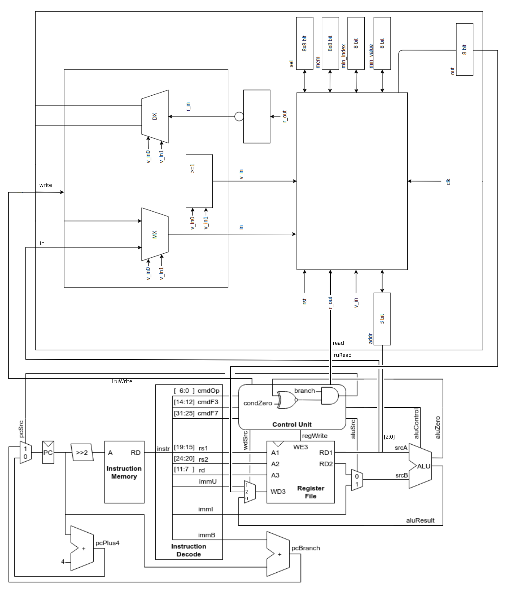

<h3 align="center" style="margin-top: 50px;">Функциональная схемотехника</h3>
<h3 align="center">Отчёт по лабораторной работе №3</h3>
<h3 align="center">Расширение возможностей учебного процессорного ядра schoolRISCV</h3>

<h3 align="center">Вариант LRU</h3>

<h3 align="right" style="margin-left: 50px; margin-top: 700px;">Выполнили: </h3>
<h3 align="right" style="margin-left: 50px;">Бутвин Михаил Павлович, P3330</h3>
<h3 align="right" style="margin-left: 50px;">Хабнер Георгий Евгеньевич, P3331</h3>

<h3 align="center" style="margin-top: 350px;">СПб – 2024</h3>

## 1. Описание задания
1. Модифицировать процессорное ядро, добавив в него модуль LRU и команды pop/push для управления им.
2. Подготовить тестовое окружение системного уровня и убедиться в корректности
вашей реализации путём запуска симуляционных тестов.

## 2. Микроархитектурная схема модифицированного процессорного ядра

Для подключения модуля LRU были добавлены управляющие сигналы `lruRead` и `lruWrite`, выставляющие флаги готовности соответствующих портво LRU.
На вход LRU был подан `RD1` - результат чтения регистра.
К адресному порту LRU подключены три младших бита `RD1`.
Выход LRU был подан на `WD3` - порт для записи в регистры. Для этого был расширен MUX и обновлен управляющий сигнал `wdSrc`.

## 3. Описание алгоритма функционирования микропроцессорного ядра в части исполнения ваших инструкций

### `POP xN`

Команда `POP xN` содержит одинаковые `rd` и `rs1`, равные `xN`.

`rs1` выберет регистр `xN` для чтения и его младшие биты будут использованы как адрес чтения LRU.

При исполнении данной команды Control Unit активирует флаг чтения буффера(`lruRead`), а также устанавливает сигнал `regWrite` в активное значение и сигнал `wdSrc` в значение `2'b10`, что означает выбор для записи в регистр сигнала, идущего с порта чтения LRU. Таким образом во время цикла LRU увидит сигнал о чтении и выставит значение на порт чтения, после чего данные с порта чтения будут захвачены файлом регистров в регистр `xN`, заданный при помощи `rd`.

### `PUSH xN`

Команда `PUSH xN` содержит `rs1`, равный `xN`.

`rs1` выберет регистр `xN` для чтения и его значение будет выведено на порт записи LRU.
При исполнении данной команды Control Unit активирует флаг записи буффера(`lruWrite`).
Итак, во время цикла LRU увидит выставленный сигнал записи и добавит значение на порте входа в память.

## 4. Результаты из отчёта по временным параметрам

## 5. Выводы

Наша модификация является простейшим способ встраивания LRU в текущую схему.
Более продвинутая модификация могла включать обновление текущего набора команд для того,
чтобы поддержать работу с LRU как с еще одним вариантом назначения арифметических и других операций.
То есть, можно было бы выполнить команды `сложи значение в регистре a0 с 1 и запиши в LRU`.
Такой подход обладает большей гибкостью и предоставляет удобный интерфейс программирования, но значительно сложнее в реализации,
поэтому мы остановились на текущем подходе.

Самой сложной частью работы было тестирование.
Так как `rars` не поддерживает добавленные нами инструкции, а переиспользовать существующие не хотелось, мы написали собственный ассемблер на python,
поддерживающий всего три инструкции, достаточные для тестирования нового функционала.
